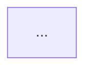

# lyonmu Blog 现代化重构实施规格

> 本文档用于直接交给 Codex 在 `lyonmu/blog` 仓库中执行。
>
> 项目仓库：`https://github.com/lyonmu/blog`
>
> 当前线上地址：`https://blog.muqingcloud.space/`
>
> 目标部署平台：Cloudflare Pages

---

## 1. 项目目标

对现有个人博客进行一次以「视觉系统 + Motion System + 首页空间感」为核心的现代化重构。

本次不是重新搭建博客，也不是替换技术框架，而是在现有 Astro 博客基础上增量演进。

最终网站定位：

> **lyonmu — Cloud Native Digital Garden**

核心视觉关键词：

- Cloud Native
- Kubernetes
- Observability
- AI / SRE
- Distributed Systems
- Infrastructure
- Engineering
- Minimal
- Spatial
- Motion

网站整体需要体现一个云原生研发工程师 / SRE / 基础设施工程师的个人技术品牌，而不是传统博客模板、赛博朋克 Hacker 模板或单纯的作品集模板。

---

## 2. 当前项目现状

当前项目已经具备：

- Astro 6
- TypeScript
- Tailwind CSS 4
- Markdown / MDX
- Astro Content Collections
- Pagefind
- Mermaid
- Shiki
- RSS
- Sitemap
- Sharp
- Astro Assets
- Bun
- Light / Dark Theme
- 已有首页、文章列表、文章详情、Gallery 等页面
- 已有本地字体体系

当前文章位于：

```text
src/data/blog
```

Gallery 位于：

```text
src/data/galleries
```

现有博客内容和路由必须保留。

---

# 3. 技术方案

## 3.1 核心技术栈

继续使用：

```text
Astro 6
TypeScript
Tailwind CSS 4
Markdown / MDX
Astro Content Collections
Pagefind
Mermaid
Shiki
Bun
Cloudflare Pages
```

新增：

```text
Anime.js 4
Three.js
@types/three
```

安装：

```bash
bun add animejs three
bun add -d @types/three
```

除上述依赖外，原则上不要新增 UI Framework、状态管理库、React/Vue/Svelte Runtime 或大型动画框架。

特别禁止为了实现 UI 而引入：

```text
React
Vue
Svelte
Next.js
Nuxt
Framer Motion
GSAP
Material UI
Ant Design
shadcn/ui
```

除非当前代码已经存在且确实需要，不要扩大技术栈。

---

# 4. 架构原则

整体架构：

```text
Markdown / MDX
       │
       ▼
Astro Content Collections
       │
       ▼
Astro Components
       │
       ├───────────────┐
       │               │
       ▼               ▼
Tailwind CSS        Motion Layer
                    │
              ┌─────┴─────┐
              ▼           ▼
          Anime.js      Three.js
              │           │
              └─────┬─────┘
                    ▼
               Static HTML
                    │
                    ▼
             Cloudflare Pages
```

原则：

1. Astro 继续负责页面和内容。
2. Tailwind 负责布局与大部分视觉。
3. Anime.js 负责 DOM 动画、交互动画、页面进入动画。
4. Three.js 仅负责首页核心 Hero 3D Scene。
5. 不允许把 Three.js 扩散到文章页面。
6. 不允许为了动画把整个 Astro 页面改造成客户端 SPA。
7. 默认保持 Astro Static Site。
8. 动画是增强层，不得影响 Markdown 阅读能力。

---

# 5. 设计方向

## 5.1 网站定位

整个网站应从：

```text
普通个人 Blog
```

升级为：

```text
Cloud Native Digital Garden
+
Engineering Journal
+
Personal Technical Identity
```

用户身份重点：

```text
Cloud Native
Kubernetes
Observability
AI / SRE
Infrastructure
Distributed Systems
```

不要重点强调：

```text
Frontend Developer
Designer
Hacker
Cyberpunk
Web3
```

---

# 6. 视觉设计系统

## 6.1 Dark Theme

推荐 Design Token：

```css
--background: #08090b;
--surface: #101216;
--surface-secondary: #15181d;

--foreground: #f2f2f2;
--muted-foreground: #8b8f98;

--border: rgba(255, 255, 255, 0.08);
--border-hover: rgba(255, 255, 255, 0.16);
```

Accent 不要使用强烈的 Cyberpunk Neon。

推荐：

```text
Cyan / Blue / Blue-Green
```

保持低饱和、高质感。

---

## 6.2 Light Theme

建议：

```css
--background: #fafafa;
--surface: #ffffff;
--surface-secondary: #f4f4f5;

--foreground: #18181b;
--muted-foreground: #71717a;

--border: rgba(0, 0, 0, 0.08);
```

---

## 6.3 视觉关键词

页面应大量使用：

```text
soft glow
thin border
subtle gradient
grid
noise
glass
depth
spatial
monospace metadata
```

禁止：

```text
大量 Neon
矩阵代码雨
过量粒子
荧光绿色 Hacker Theme
强烈 RGB Gradient
大面积 Glassmorphism
```

---

# 7. Typography

优先复用当前项目已有本地字体。

当前已有：

```text
Wotfard
Sriracha
Cartograph CF
Cascadia Code
```

不要为了这次 UI 重构下载新的字体。

推荐用途：

```text
Wotfard
→ UI / 正文

Cartograph CF
→ Engineering Metadata
→ Terminal Prompt
→ Badge

Cascadia Code
→ Code / System Status
```

页面中可以适度加入：

```text
SYS.STATUS
~/notes
01
02
03
2026.09.07
[ ACTIVE ]
KUBERNETES
OBSERVABILITY
```

此类 metadata。

---

# 8. 页面信息架构

主要页面保持：

```text
/
├── 首页
│
├── /posts
│   └── 文章列表
│
├── /posts/[slug]
│   └── 文章详情
│
├── /tags
│
├── /search
│
├── /archives
│
├── /about
│
└── /galleries
```

不要随意修改现有 URL。

避免影响已有 SEO。

---

# 9. 首页设计

首页是此次重构最重点页面。

目标布局：

```text
┌──────────────────────────────────────────────────────────────┐
│ LYONMU                                     Notes About  ◐    │
│                                                              │
│ ~/lyonmu                                      ·              │
│                                               ·     ○        │
│ Building systems                             ○───○            │
│ that observe,                                │ K8S │          │
│ reason and evolve.                           ○───○            │
│                                            ·      ○          │
│ Cloud Native / Observability / AI SRE          ·             │
│                                                              │
│ [ Explore Notes → ]        Engineering Journal              │
│                                                              │
├──────────────────────────────────────────────────────────────┤
│ FEATURED                                                     │
│                                                              │
│ ┌─────────────────────────────┐ ┌──────────────────────────┐ │
│ │ Dynamic Baseline            │ │ Kubernetes               │ │
│ │ Observability / AI          │ │ Infrastructure           │ │
│ └─────────────────────────────┘ └──────────────────────────┘ │
│                                                              │
├──────────────────────────────────────────────────────────────┤
│ RECENT NOTES                                                 │
│                                                              │
│ 01   Kubernetes ...                              2026.09.07  │
│ 02   OpenTelemetry ...                           2026.09.05  │
│ 03   AI SRE ...                                  2026.09.01  │
└──────────────────────────────────────────────────────────────┘
```

---

# 10. Hero Section

Hero 使用左右布局。

Desktop：

```text
左侧 55%
右侧 45%
```

左侧：

```text
Terminal Badge
Headline
Description
CTA
Engineering Metadata
```

右侧：

```text
Three.js Infrastructure Scene
```

Mobile：

```text
Hero Text
↓
轻量 Scene
```

或者在较低性能设备上：

```text
Hero Text
↓
Static CSS Infrastructure Graph
```

---

# 11. Hero 文案

不要把首页写成传统：

```text
Hi, I'm Lyon.
Frontend Developer.
```

推荐：

```text
~/lyonmu

Building systems
that observe,
reason and evolve.

Cloud Native · Observability · AI / SRE
```

中文可以作为辅助：

```text
记录云原生、可观测性、AI SRE 与工程实践。
```

不要写过于营销化、自我吹捧的文案。

---

# 12. Three.js Infrastructure Scene

实现：

```text
src/components/motion/HeroScene.astro
```

以及：

```text
src/scripts/motion/heroScene.ts
```

Hero Scene 表现基础设施拓扑，而不是普通 3D Sphere。

概念：

```text
                  ●
                 / \
                /   \
               ●─────●
                \   /
                 ●
                 │
              K8S
                 │
                 ●
          OpenTelemetry
                 │
                 ●
               AI/SRE
```

节点应表现：

```text
Kubernetes
Metrics
Traces
Logs
OpenTelemetry
AI / SRE
Infrastructure
```

但不要显示大量文字。

节点可以使用：

```text
SphereGeometry
IcosahedronGeometry
Line
Points
```

要求：

- 节点数量控制在合理范围。
- 不使用大型 3D 模型。
- 不下载 `.glb/.gltf`。
- 不加入复杂材质。
- 不使用后处理。
- 不使用 bloom composer。
- 不加入额外 Three.js 插件。

视觉：

```text
small nodes
thin lines
subtle glow
slow float
depth
parallax
```

---

# 13. Hero Scene Interaction

Desktop 鼠标移动：

```text
rotateX ≈ ±4°
rotateY ≈ ±6°
```

轻微，不要跟手过强。

Scene idle：

```text
slow rotation
slow floating
small node pulse
```

用户滚动时：

```text
opacity ↓
translateY
rotate
```

但不要造成明显眩晕。

---

# 14. Anime.js Motion System

创建：

```text
src/scripts/motion/
```

推荐目录：

```text
src/scripts/motion/
├── index.ts
├── hero.ts
├── heroScene.ts
├── cards.ts
├── reveal.ts
├── navigation.ts
├── magnetic.ts
├── reducedMotion.ts
└── cleanup.ts
```

组件：

```text
src/components/motion/
├── HeroScene.astro
├── Reveal.astro
├── TiltCard.astro
├── GlowCard.astro
├── MagneticButton.astro
└── BackgroundGrid.astro
```

如果部分组件没有必要独立，不要为了满足目录而机械创建。

原则：

> 目录服务于代码，而不是代码服务于目录。

---

# 15. 页面进入动画

推荐首页 Timeline：

```text
0ms
Background Grid fade

100ms
Terminal Badge

180ms
Headline Line 1

240ms
Headline Line 2

320ms
Description

400ms
CTA

480ms
Engineering Metadata

500ms
Three.js Scene
```

总时长尽量：

```text
< 1200ms
```

禁止：

```text
首页 Loading Screen
超过 2 秒的 Intro
必须等待动画结束才能操作
```

---

# 16. Scroll Reveal

使用 Anime.js + IntersectionObserver。

不要每帧扫描 DOM。

统一：

```text
data-reveal
```

例如：

```html
<section data-reveal>
```

动画：

```text
opacity: 0 → 1
translateY: 16px → 0
```

Duration：

```text
400 ~ 700ms
```

Stagger：

```text
40 ~ 80ms
```

只执行一次。

---

# 17. Card 系统

首页 Featured Card 改造成 Bento 风格。

推荐：

```text
┌───────────────────────────┬──────────────┐
│                           │              │
│ Featured Article          │ Kubernetes   │
│                           │              │
│ Dynamic Baseline          ├──────────────┤
│                           │ OpenObserve  │
├───────────────┬───────────┴──────────────┤
│ AI / SRE      │ Observability            │
└───────────────┴──────────────────────────┘
```

注意：

不要强制每篇 Featured 都占固定不同 Grid。

可根据 index 设置简单 variant：

```text
large
normal
wide
```

同时确保当 Featured 数量变化时布局不会破坏。

---

# 18. Card Hover

Hover 动画：

```text
translateY: -2 ~ -4px
rotateX: ±1 ~ 2deg
rotateY: ±1 ~ 2deg
border opacity ↑
background gradient shift
```

Mouse glow：

继续复用当前已有的 cursor glow 思路，但统一封装。

不能在每次 `mousemove` 内创建新的 Anime.js animation。

mousemove 应仅：

```text
更新 CSS Variable
```

例如：

```css
--mouse-x
--mouse-y
```

Animation 使用 CSS 或 requestAnimationFrame 节流。

---

# 19. Recent Posts

Recent Posts 不要全部做成 Card。

推荐更 engineering 的列表：

```text
01   Kubernetes 中的动态基线实践
     Kubernetes · Observability
                                      2026.09.07

02   OpenTelemetry Collector 部署
     Observability
                                      2026.09.04

03   AI SRE Agent Design
     AI · SRE
                                      2026.08.30
```

Hover：

```text
number color
title translateX 4px
arrow appear
border highlight
```

整体比 Card Grid 更适合长期博客。

---

# 20. Header

Header 风格：

```text
LYONMU

Notes
Tags
Gallery
About
Search

Theme Toggle
```

Desktop：

- Sticky
- 半透明背景
- backdrop blur
- thin border bottom

滚动：

```text
header height slightly shrink
background opacity ↑
```

不要做复杂 Header 动画。

Mobile：

```text
Logo
Search
Menu
```

菜单应易用。

---

# 21. Navigation Transition

Astro 页面跳转如果项目已使用 View Transitions，则沿用。

如果没有，不为了此次需求强制引入复杂 View Transition。

页面进入动画需要监听：

```text
astro:page-load
```

避免只监听：

```text
DOMContentLoaded
```

否则 Astro 页面导航后动画可能失效。

必须避免重复注册 Event Listener。

---

# 22. About 页面

About 页面设计成：

```text
Profile
+
Engineering Timeline
+
Technology Areas
+
Current Interests
```

建议内容结构：

```text
ABOUT

Cloud Native Engineer

Focus
├── Kubernetes
├── Observability
├── AI / SRE
├── Distributed Systems
└── Infrastructure

NOW

Currently exploring
AI driven observability
dynamic baseline
agentic SRE
```

不要做技能百分比进度条：

```text
Kubernetes ████████ 95%
Go         ███████  90%
```

此类 UI 禁止。

---

# 23. Posts 页面

文章列表页面：

```text
Notes
Engineering Journal

[ All ] [ Kubernetes ] [ AI ] [ Observability ]

Search
```

文章按年份组织。

例如：

```text
2026

09.07
Kubernetes 动态基线告警实践

09.05
OpenTelemetry Collector ...

08.31
...
```

可以加入：

```text
tag
date
reading time
```

但不要信息过载。

---

# 24. Article 页面

文章详情页必须以阅读体验为第一优先级。

动画强度：

```text
Homepage
████████░░

Posts
████░░░░░░

Article
██░░░░░░░░
```

Article 页面不要放 Three.js。

---

# 25. Article Layout

Desktop：

```text
┌───────────────────────────────────────────────┐

                Article Header

          Title
          Description
          Date / Tags / Reading Time

────────────────────────────────────────────────

              Markdown Content
                  ~760px

                                  Table of Contents

────────────────────────────────────────────────
```

正文宽度：

```text
680px ~ 780px
```

不要超过约：

```text
820px
```

---

# 26. Article 功能

保留并完善：

- Shiki Code Highlight
- Mermaid
- TOC
- Heading Anchor
- Code Copy
- Image
- Blockquote
- List
- Table

建议新增：

```text
Reading Progress
Image Zoom
```

如果实现 Image Zoom 需要新增重量级依赖，则不要做。

优先纯 CSS / JS。

---

# 27. Reading Progress

文章页顶部：

```text
1px ~ 2px
```

阅读进度条。

使用：

```text
transform: scaleX()
```

不要不断修改 width。

颜色：

```text
accent
```

Scroll handler 必须：

```text
requestAnimationFrame
```

或 passive listener。

---

# 28. Table of Contents

Desktop：

```text
position: sticky
```

显示：

```text
H2
H3
```

Active heading：

```text
accent line
foreground
```

Mobile：

隐藏 Sidebar。

可以使用 Collapsible TOC。

不要为了 TOC 引入 JS Framework。

---

# 29. Code Block

代码是技术博客重要部分。

要求：

```text
filename
language
copy button
line highlight
diff
```

继续复用现有 Shiki Transformer。

不要替换现有 Shiki 配置。

代码块视觉：

```text
rounded-xl
thin border
surface background
```

避免巨大阴影。

---

# 30. Mermaid

继续保留当前 Mermaid Markdown 支持。

不要修改 Markdown 作者写法。

继续支持：

````markdown

````

如果 Mermaid 初始化已经存在，确保：

```text
Astro page navigation
Theme change
```

后能够正确重新渲染或保持正常。

---

# 31. Tags

Tags UI：

```text
Kubernetes
Observability
AI
SRE
Cloud Native
```

设计成简洁 label。

不要大量彩色 Tag。

统一 Accent + Neutral。

---

# 32. Search

继续使用：

```text
Pagefind
```

不要换 Algolia。

Search 页面可以增加：

```text
Keyboard shortcut
⌘ K
```

如果项目已有 Command Search，则复用。

没有则可以实现轻量 Search Dialog。

禁止为此引入完整 Command Palette Library。

---

# 33. Background Grid

实现一个非常轻的 Engineering Grid。

例如：

```css
background-image:
  linear-gradient(...),
  linear-gradient(...);
```

Grid：

```text
24px ~ 48px
```

Opacity：

```text
0.02 ~ 0.06
```

不要过于明显。

Hero 可以比文章页明显。

文章页应基本看不到。

---

# 34. Noise

如需 Noise：

优先 CSS / inline SVG data URI。

不要增加大型 Noise 图片。

Opacity：

```text
< 0.03
```

---

# 35. Glow

Glow 仅作为：

```text
Accent feedback
```

禁止整个页面大面积 Glow。

允许：

```text
Hero node
Featured card hover
CTA hover
Active nav
```

---

# 36. Magnetic Button

仅针对首页 CTA 使用。

例如：

```text
Explore Notes →
```

鼠标靠近：

```text
translateX
translateY
```

最大位移：

```text
6px
```

离开后恢复。

Mobile 禁用。

---

# 37. Reduced Motion

必须实现：

```text
prefers-reduced-motion
```

例如：

```ts
window.matchMedia("(prefers-reduced-motion: reduce)").matches
```

开启 Reduce Motion 时：

关闭：

```text
3D rotation
continuous floating
parallax
tilt
magnetic
stagger
```

保留：

```text
instant state transition
必要 opacity
```

CSS 同时：

```css
@media (prefers-reduced-motion: reduce) {
  ...
}
```

---

# 38. Mobile Performance

Mobile 必须降低：

```text
Three.js nodes
particle count
animation duration
blur
shadow
mouse interaction
```

建议断点：

```text
< 768px
```

关闭：

```text
Tilt
Magnetic
Mouse Parallax
```

Hero Scene 可以保留简化版。

---

# 39. Low Power / WebGL Fallback

如果：

```text
WebGL unavailable
```

页面必须正常工作。

HeroScene container 显示：

```text
CSS Static Topology
```

或者干脆隐藏 Canvas。

不能因为 Three.js 初始化错误导致首页报错。

---

# 40. JavaScript 生命周期

这是 Astro 项目，必须特别关注 Listener Cleanup。

禁止：

```ts
document.addEventListener("astro:page-load", () => {
  element.addEventListener(...)
});
```

每次导航不断叠加 Listener。

Motion 模块建议实现：

```ts
initMotion()
destroyMotion()
```

例如：

```text
AbortController
```

统一清理 Listener。

或者保存 cleanup functions。

---

# 41. 动画性能规则

优先动画：

```text
transform
opacity
```

避免：

```text
width
height
top
left
margin
padding
```

持续动画数量：

```text
<= 3
```

首页 Three.js Canvas：

```text
<= 1
```

不要在 Background 创建第二个 Canvas。

---

# 42. Three.js Render Loop

Three.js 必须：

```text
requestAnimationFrame
```

页面不可见时暂停：

```text
document.visibilityState
```

或者：

```text
visibilitychange
```

Canvas 离开 viewport 时也可以暂停。

Resize：

```text
ResizeObserver
```

或 window resize + debounce。

Pixel Ratio：

```ts
Math.min(window.devicePixelRatio, 1.5)
```

移动设备可以：

```text
<= 1.25
```

不要无上限使用：

```text
devicePixelRatio
```

---

# 43. Three.js Resource Cleanup

destroy 时释放：

```text
geometry.dispose()
material.dispose()
renderer.dispose()
cancelAnimationFrame()
```

并移除：

```text
mousemove
resize
visibilitychange
```

等监听。

必须防止 Astro 页面切换后 GPU Resource 泄漏。

---

# 44. SEO

现有 SEO 功能必须保持。

包括：

```text
title
description
canonical
OpenGraph
RSS
sitemap
robots
```

不要改变已有文章 URL。

不要因为 Hero 动画影响：

```text
H1
文章 Title
Meta Description
```

---

# 45. Accessibility

必须满足：

```text
semantic HTML
keyboard navigation
focus-visible
aria-label
prefers-reduced-motion
color contrast
```

Canvas：

```html
aria-hidden="true"
```

因为 Hero 3D Scene 是装饰性内容。

页面核心信息必须以 HTML 存在，不能只画在 Canvas 中。

---

# 46. Cloudflare Pages

项目保持：

```text
Static Output
```

不要加入：

```text
@astrojs/cloudflare
```

除非确实引入 SSR / Functions。

当前需求不需要。

Cloudflare Pages：

```text
Production branch:
master
```

Build：

```bash
bun run build
```

Output：

```text
dist
```

Root：

```text
/
```

---

# 47. Cloudflare 构建

Cloudflare Pages 建议配置：

```text
BUN_VERSION
```

与本地 Bun 版本保持一致。

如果仓库后续加入：

```text
.tool-versions
```

或其他版本配置，优先使用单一来源。

不要为了部署添加 Docker。

---

# 48. Content System

必须继续使用现有：

```text
src/content.config.ts
```

不要引入 CMS。

文章仍然：

```text
src/data/blog/**/*.md
src/data/blog/**/*.mdx
```

保持 Git Based Content。

---

# 49. Markdown Frontmatter

继续支持：

```yaml
---
author:
pubDatetime:
modDatetime:
title:
featured:
draft:
tags:
ogImage:
description:
canonicalURL:
hideEditPost:
timezone:
---
```

不要删除字段。

可以在确实需要时新增：

```yaml
series:
```

但此次 UI 重构默认不要修改 Schema。

---

# 50. Gallery

Gallery 功能不是此次核心。

原则：

```text
保持可用
视觉跟随新 Design Token
不要重写功能
```

---

# 51. Footer

Footer 尽量简洁。

推荐：

```text
lyonmu

Cloud Native · Observability · AI/SRE

GitHub
RSS

© 2026
```

可以加入：

```text
Built with Astro
Deployed on Cloudflare
```

但不要太多 Badge。

---

# 52. 推荐目录

最终可以演进为：

```text
src/
├── assets/
│
├── components/
│   ├── Header.astro
│   ├── Footer.astro
│   │
│   ├── home/
│   │   ├── Hero.astro
│   │   ├── FeaturedGrid.astro
│   │   └── RecentNotes.astro
│   │
│   ├── blog/
│   │   ├── PostCard.astro
│   │   ├── PostListItem.astro
│   │   ├── TableOfContents.astro
│   │   └── ReadingProgress.astro
│   │
│   └── motion/
│       ├── HeroScene.astro
│       ├── BackgroundGrid.astro
│       ├── GlowCard.astro
│       └── TiltCard.astro
│
├── data/
│   ├── blog/
│   └── galleries/
│
├── layouts/
│   ├── Layout.astro
│   └── PostDetails.astro
│
├── pages/
│   ├── index.astro
│   ├── posts/
│   ├── tags/
│   ├── search.astro
│   └── ...
│
├── scripts/
│   └── motion/
│       ├── index.ts
│       ├── hero.ts
│       ├── heroScene.ts
│       ├── cards.ts
│       ├── reveal.ts
│       └── reducedMotion.ts
│
├── styles/
│   ├── global.css
│   ├── typography.css
│   └── ...
│
├── config.ts
├── constants.ts
└── content.config.ts
```

这是目标结构，不要求机械重构所有现有文件。

只移动与本次设计重构直接相关的内容。

---

# 53. 实施阶段

Codex 不要一次性重写整个仓库。

按照以下顺序执行。

---

## Phase 1：代码审计

首先检查：

```text
package.json
astro.config.ts
AGENTS.md

src/config.ts
src/constants.ts

src/layouts/*
src/pages/*
src/components/*
src/styles/*
src/scripts/*

src/content.config.ts
```

确认：

- 当前 Theme 机制
- 当前 Layout
- 当前 Header
- 当前 Footer
- 当前 Card
- 当前 Search
- 当前 Post Layout
- 当前 Page Transition
- 当前 Mermaid 初始化
- 当前已有动画
- 当前 Breakpoints

不要凭猜测覆盖已有实现。

---

# 54. Phase 2：Design Token

先整理：

```text
Background
Surface
Foreground
Muted
Border
Accent
Radius
Shadow
Glow
```

优先复用现有 CSS Variable。

如果现有变量命名合理：

```text
不要全部改名
```

只补充缺失变量。

目标：

```text
Dark / Light 一致
Component 不写散乱 Hex
```

---

# 55. Phase 3：Global Background

实现：

```text
BackgroundGrid
Subtle Noise
Page Surface
```

确保：

```text
Dark
Light
Mobile
Reduced Motion
```

均正常。

---

# 56. Phase 4：Header / Navigation

重构 Header：

- modern
- sticky
- blur
- clear active state
- responsive

保持现有链接。

完成后运行：

```bash
bun run build
```

---

# 57. Phase 5：Homepage Hero

重构首页 Hero。

先做纯 HTML/CSS 布局。

确认：

```text
Desktop
Tablet
Mobile
Light
Dark
```

之后再加入 Anime.js。

最后加入 Three.js。

不要一开始把 layout + Anime.js + Three.js 同时实现。

---

# 58. Phase 6：Motion Foundation

安装：

```bash
bun add animejs three
bun add -d @types/three
```

实现：

```text
Reduced Motion
Reveal
Hero Timeline
Cleanup Lifecycle
```

确认 Astro 页面导航不会重复初始化。

---

# 59. Phase 7：Three.js Scene

实现：

```text
HeroScene
```

要求：

- Only homepage
- Lazy init
- No external models
- Proper dispose
- Reduced Motion
- Mobile degradation
- WebGL failure fallback

完成后检查：

```text
Memory
CPU
Scroll
Resize
Theme
Navigation
```

---

# 60. Phase 8：Featured Bento

重构 Featured Articles。

实现：

```text
Bento Layout
Glow
Tilt
Responsive
```

保证：

```text
0 featured
1 featured
2 featured
3+
```

均正常。

---

# 61. Phase 9：Recent Notes

将首页 Recent Posts 视觉升级为：

```text
Engineering Journal List
```

保持：

```text
title
date
tags
description
```

是否显示 Description 根据视觉密度决定。

---

# 62. Phase 10：Posts / Tags / Search

统一 Design System。

不要过度动画。

确保 Pagefind 正常。

---

# 63. Phase 11：Article Reading Experience

重构：

```text
Post Header
Typography
TOC
Reading Progress
Code Block
Mermaid
Image
Tables
Blockquotes
```

不要修改 Markdown 内容。

---

# 64. Phase 12：About / Gallery / Footer

视觉收口。

不要新增复杂功能。

---

# 65. 响应式要求

必须至少验证：

```text
375px
768px
1024px
1440px
```

重点：

```text
Hero
Header
Bento
Post
TOC
Search
```

禁止横向滚动。

---

# 66. 浏览器要求

至少保证：

```text
Chrome
Safari
Firefox
```

Three.js 不能影响 Safari 页面基本使用。

---

# 67. 性能目标

本次不是要求为 Lighthouse 数字做极端优化，但必须控制。

目标：

```text
Homepage JS:
尽量 < 250 KB gzip
```

Three.js 是主要体积来源。

必须确保 Three.js：

```text
只进入首页相关 bundle
```

不要在 Layout：

```ts
import * as THREE from "three";
```

否则全站都会加载。

Three.js 应在 HeroScene：

```text
dynamic import
```

或确保 Astro/Vite 能拆包。

---

# 68. Lazy Load

HeroScene 可以：

```text
requestIdleCallback
```

或 Hero 进入 viewport 后加载。

但不要让用户明显看到：

```text
空白 → 突然 Canvas
```

先显示 static fallback。

Three.js ready 后平滑：

```text
opacity 0 → 1
```

---

# 69. 图片性能

继续使用 Astro Image / Sharp。

不要：

```text

```

Article 图片保持 responsive。

Gallery 不做大规模重构。

---

# 70. 禁止事项

Codex 必须遵循以下禁止项。

## 不允许换框架

禁止：

```text
Astro → Next.js
Astro → Nuxt
Astro → React SPA
```

---

## 不允许改内容系统

禁止：

```text
Markdown → CMS
Markdown → Database
```

---

## 不允许过度引入依赖

此次原则只增加：

```text
animejs
three
@types/three
```

---

## 不允许无关重构

例如不要：

```text
重命名所有文件
重新格式化整个项目
重写所有 utils
调整与 UI 无关的数据逻辑
修改文章内容
```

---

## 不允许破坏路由

现有文章 URL 必须保持。

---

## 不允许破坏 SEO

现有：

```text
RSS
Sitemap
Canonical
OG Image
```

必须保留。

---

## 不允许 Console

遵循项目 ESLint：

```text
不要 console.log
```

错误处理：

- 可静默 fallback 的装饰动画应 graceful fallback。
- 真正需要报告的问题使用项目已有错误处理方式。
- 不要为了调试遗留 console。

---

# 71. Coding Style

遵循仓库 AGENTS.md。

必须：

```text
Bun
2 spaces
semicolon
double quotes
LF
Prettier
ESLint
PascalCase Astro Component
camelCase utility
```

不要进行无关格式化。

---

# 72. Error Handling

例如：

```text
Three.js 初始化失败
```

应该：

```text
隐藏 Canvas
保持 CSS Background
网站继续正常
```

而不是：

```text
throw
导致首页不可用
```

动画属于 Progressive Enhancement。

---

# 73. 测试命令

每个主要 Phase 完成至少运行：

```bash
bun run build
```

最终必须运行：

```bash
bun run lint
bun run format:check
bun run build
```

如果 format:check 失败：

```bash
bun run format
```

但不要借此格式化不相关文件。

---

# 74. 手工验收

Codex 完成后需要检查：

## Homepage

```text
[ ] Hero Desktop 正常
[ ] Hero Mobile 正常
[ ] Dark 正常
[ ] Light 正常
[ ] Scene 正常
[ ] Scene fallback 正常
[ ] CTA 正常
[ ] Featured Bento 正常
[ ] Recent Notes 正常
```

## Motion

```text
[ ] 首次进入正常
[ ] 内部页面返回首页正常
[ ] 动画不会重复叠加
[ ] Reduced Motion 正常
[ ] Mobile 不跟踪鼠标
[ ] 页面切换后无明显性能下降
```

## Article

```text
[ ] Markdown 正常
[ ] Code 正常
[ ] Mermaid 正常
[ ] Table 正常
[ ] Image 正常
[ ] TOC 正常
[ ] Reading Progress 正常
```

## Search

```text
[ ] Pagefind build 成功
[ ] Search 正常
```

## SEO

```text
[ ] RSS 正常
[ ] Sitemap 正常
[ ] Metadata 正常
```

---

# 75. Cloudflare Pages 验收

必须保证：

```bash
bun run build
```

输出：

```text
dist/
```

Cloudflare Pages 不需要 Server Runtime。

不新增：

```text
Dockerfile
Node Server
Express
Fastify
```

---

# 76. Git 变更原则

Codex 实现过程中：

```text
只修改本需求相关文件
```

提交前：

```bash
git diff --stat
git diff
```

确认不存在：

```text
无关格式化
文章内容变动
静态资源意外删除
lockfile 大面积非必要修改
```

`bun.lock` 因新增 animejs / three 变化是正常的。

---

# 77. 最终 Deliverables

实现结束应至少包含：

```text
1. 新 Design System
2. 新 Homepage Hero
3. Anime.js Motion Layer
4. Three.js Infrastructure Hero Scene
5. Featured Bento
6. Recent Notes
7. Modern Header
8. Modern Footer
9. Posts UI
10. Article Reading UI
11. Reduced Motion
12. Mobile Fallback
13. Cloudflare Pages Compatible Build
```

---

# 78. 优先级

如果工作量较大，严格按照：

```text
P0
Design Token
Homepage
Header
Article
Responsive
Build

P1
Anime.js
Three.js
Bento
Reading Progress
TOC improvements

P2
About
Gallery polish
Search dialog
small micro-interactions
```

不要为了 P2 延迟 P0。

---

# 79. 最终视觉判断

网站应该让访问者第一印象是：

```text
这是一个长期做 Cloud Native / Infrastructure /
Observability / AI SRE 的工程师自己的技术空间。
```

而不是：

```text
这是一个下载的 Astro Blog Theme。
```

同时也不能变成：

```text
炫技 3D Demo
```

核心优先级始终：

```text
Content
>
Typography
>
Layout
>
Motion
>
3D
```

---

# 80. Codex 工作指令

执行本任务时：

1. 先阅读 `AGENTS.md`。
2. 检查当前实现，不要根据本文档假设文件内容。
3. 复用已有功能，而不是重写。
4. 保留 Markdown、MDX、Pagefind、Mermaid、Shiki、RSS、Sitemap。
5. 保留所有现有文章和 URL。
6. 使用 Astro + Tailwind + TypeScript。
7. 新增 Anime.js + Three.js。
8. Three.js 只用于首页 Hero。
9. 页面动画统一管理生命周期。
10. 必须支持 `prefers-reduced-motion`。
11. 保持 Cloudflare Pages Static Deployment。
12. 不新增后端。
13. 不增加数据库。
14. 不新增 CMS。
15. 不做无关重构。
16. 不修改文章内容。
17. 不主动提交 Git commit，除非明确要求。
18. 完成后执行：

```bash
bun run lint
bun run format:check
bun run build
```

19. 修复所有本次改动导致的问题。
20. 最终输出：

```text
- 修改文件列表
- 主要实现说明
- 动画/Three.js 生命周期说明
- Responsive / Reduced Motion 说明
- 测试结果
- 仍存在的限制
```

---

# 81. 推荐给 Codex 的执行 Prompt

将本文档放入仓库，例如：

```text
docs/BLOG_REDESIGN_SPEC.md
```

然后向 Codex 输入：

```text
请完整阅读仓库中的 AGENTS.md 和 docs/BLOG_REDESIGN_SPEC.md。

根据 BLOG_REDESIGN_SPEC.md 对当前博客进行现代化重构。

在开始修改之前，先自行检查当前项目结构、现有组件、布局、样式、
主题机制、Markdown 渲染、文章详情、搜索、Mermaid 和现有动画实现。

实现时必须基于现有代码增量修改，不要重新创建项目，不要替换 Astro，
不要修改文章内容，不要改变现有文章 URL，不要进行无关重构。

请自主使用可用工具检查代码并完成实现。
不要等待我逐步确认普通实现细节；在规格允许范围内自行做合理工程决策。

技术核心：
- Astro 6
- TypeScript
- Tailwind CSS 4
- Markdown / MDX
- Anime.js 4
- Three.js
- Pagefind
- Cloudflare Pages Static Deployment

重点完成：
1. 新 Design System
2. Modern Header / Footer
3. 首页 Hero
4. Anime.js Motion System
5. Three.js Infrastructure Hero Scene
6. Featured Bento
7. Recent Notes
8. Posts 页面视觉升级
9. Article Reading Experience
10. Responsive
11. prefers-reduced-motion
12. Three.js / Event Listener cleanup
13. Cloudflare Pages build compatibility

优先保证内容、可读性、性能和工程质量，不要把网站做成 3D Demo。

完成后执行：
bun run lint
bun run format:check
bun run build

修复所有由本次修改导致的错误。

最后只需要向我汇报：
- 修改了哪些文件
- 实现了哪些内容
- 关键工程设计
- 测试结果
- 尚存限制或建议
```

---

# 82. 最重要的设计原则

最后统一遵守：

```text
Cloud Native
not Cyberpunk

Engineering
not Hacker Theme

Spatial
not 3D Demo

Motion
not Animation Spam

Minimal
not Empty

Modern
not Template

Content First
```

最终目标：

> **一个现代、克制、有空间感和工程师身份辨识度的 Cloud Native Digital Garden。**
