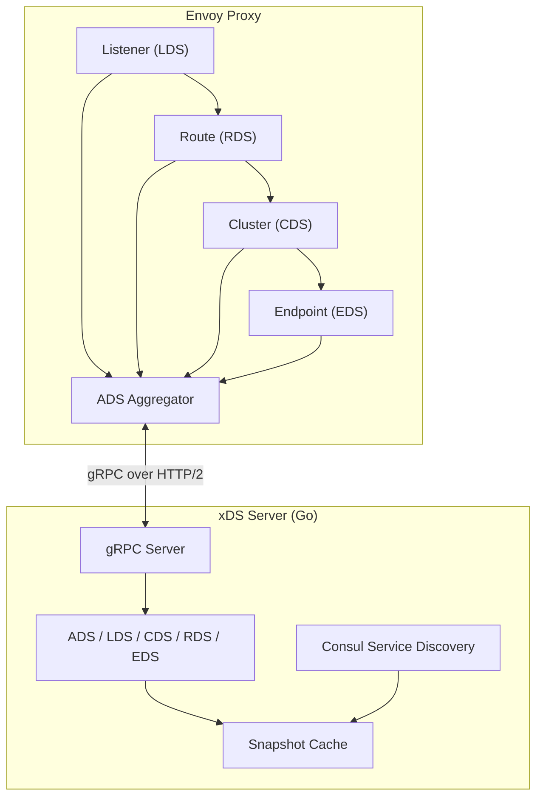
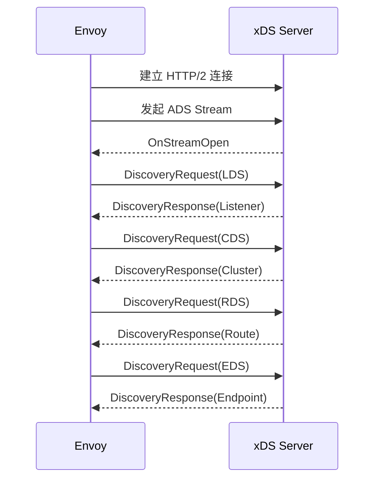
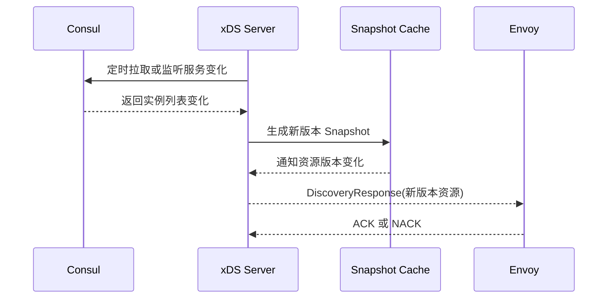

## xDS 是什么

xDS（Extensible Discovery Service）是一组用于服务发现和动态配置的协议。它常见
于 Envoy、Istio 等架构中，用来动态管理 listener、route、cluster、endpoint、
secret 等资源。

相比静态配置，xDS 的价值在于：Envoy 可以长期运行，控制面根据服务变化推送新的
配置快照，数据面在不中断进程的情况下完成配置更新。

这篇文章按 Envoy 启动后的真实路径来理解 xDS：先通过静态 bootstrap 找到 xDS
Server，再建立 ADS Stream，随后按 LDS、CDS、RDS、EDS 等资源依赖逐步拿到完整
转发配置。

## xDS 相关服务

xDS 包含多种发现服务，每种服务负责不同类型的资源：

1. **LDS（Listener Discovery Service）**：管理 listener，决定 Envoy 如何接收和
   处理入站连接。
2. **RDS（Route Discovery Service）**：管理 route，决定请求如何按规则路由到不同
   服务。
3. **CDS（Cluster Discovery Service）**：管理 cluster，cluster 代表一组逻辑上相似
   的上游服务。
4. **EDS（Endpoint Discovery Service）**：管理 endpoint，提供 cluster 下具体服务
   实例的地址。
5. **SDS（Secret Discovery Service）**：管理 TLS 证书、私钥等安全配置。
6. **VHDS（Virtual Host Discovery Service）**：为 RDS 提供虚拟主机配置。
7. **SRDS（Scoped Route Discovery Service）**：管理 scoped route，可基于请求头等
   条件选择不同路由作用域。
8. **RTDS（Runtime Discovery Service）**：管理运行时配置，常用于开关和实验性功能。
9. **ECDS（Extension Config Discovery Service）**：为网络过滤器、HTTP 过滤器和
   listener 过滤器提供动态扩展配置。

这些服务可以独立使用，也可以通过 ADS（Aggregated Discovery Service）聚合在同一
条 gRPC stream 中。

## 一个典型架构

下面以基于 go-control-plane 的 xDS Server 为例。xDS Server 从 Consul 等服务发现
系统获取实例变化，生成 snapshot cache，再通过 gRPC 把资源推送给 Envoy。



## Bootstrap 中启用 ADS

Envoy 需要先通过静态 bootstrap 配置知道 xDS Server 在哪里，然后再从 xDS Server
拉取动态资源。

```yaml
admin:
  address:
    socket_address:
      address: 0.0.0.0
      port_value: 20416

dynamic_resources:
  ads_config:
    api_type: GRPC
    grpc_services:
      - envoy_grpc:
          cluster_name: sentinel_gateway_cluster
  lds_config:
    ads: {}
  cds_config:
    ads: {}

static_resources:
  clusters:
    - name: sentinel_gateway_cluster
      connect_timeout: 5s
      type: strict_dns
      lb_policy: round_robin
      http2_protocol_options: {}
      load_assignment:
        cluster_name: sentinel_gateway_cluster
        endpoints:
          - lb_endpoints:
              - endpoint:
                  address:
                    socket_address:
                      address: 127.0.0.1
                      port_value: 20417
```

这里的关键点是：`sentinel_gateway_cluster` 是静态 cluster，用来连接 xDS Server；
`lds_config` 和 `cds_config` 使用 `ads: {}`，表示资源通过 ADS stream 获取。

## Stream 建立流程

Envoy 启动后，会先建立到 xDS Server 的 HTTP/2 连接，再发起 ADS gRPC stream。
之后按照资源依赖关系请求配置。



一般可以按依赖关系理解这条链路：

- LDS 告诉 Envoy 应该监听哪些入口；
- listener 中的 HTTP connection manager 可能引用 RDS；
- route 会引用 cluster；
- cluster 再通过 EDS 获取具体 endpoint。

## go-control-plane 回调

使用 go-control-plane 实现 xDS Server 时，常见回调包括 stream 打开、关闭、请求和
响应发送。

```go
type defaultCallbacks struct{}

func (c *defaultCallbacks) OnStreamOpen(
    ctx context.Context,
    streamID int64,
    typeURL string,
) error {
    global.Logger.Infof(
        "gateway xDS stream opened: streamID=%d, typeURL=%s",
        streamID,
        typeURL,
    )
    return nil
}

func (c *defaultCallbacks) OnStreamClosed(streamID int64, node *core.Node) {
    global.Logger.Infof("gateway xDS stream closed: streamID=%d", streamID)
}

func (c *defaultCallbacks) OnStreamRequest(
    streamID int64,
    request *discoverygrpc.DiscoveryRequest,
) error {
    global.Logger.Debugf(
        "stream request: type=%s, node=%s",
        request.TypeUrl,
        request.Node.Id,
    )
    return nil
}

func (c *defaultCallbacks) OnStreamResponse(
    ctx context.Context,
    streamID int64,
    request *discoverygrpc.DiscoveryRequest,
    response *discoverygrpc.DiscoveryResponse,
) {
    global.Logger.Debugf("stream response: type=%s", response.TypeUrl)
}
```

这些回调主要用于观测和调试。真正决定 Envoy 收到什么配置的是 snapshot cache 中
的资源内容和版本。

## 配置更新流程

完整流程可以概括为：

1. xDS Server 定时或通过事件监听服务发现系统；
2. 服务实例发生变化后，xDS Server 生成新的资源 snapshot；
3. snapshot cache 版本变化；
4. 已连接的 Envoy 通过 ADS stream 收到新的 `DiscoveryResponse`；
5. Envoy 校验资源，成功后 ACK，失败后 NACK；
6. 新配置在 Envoy 内部完成更新，并用于后续流量转发。



## 小结

xDS 的本质是控制面和数据面之间的动态配置协议。Envoy 通过 bootstrap 找到 xDS
Server，再通过 ADS stream 持续接收 LDS、CDS、RDS、EDS 等资源。

排查 xDS 问题时，可以沿着这条链路看：bootstrap 是否能连上 xDS Server，stream
是否建立，资源版本是否变化，Envoy 是否 ACK，以及资源之间的引用关系是否完整。
